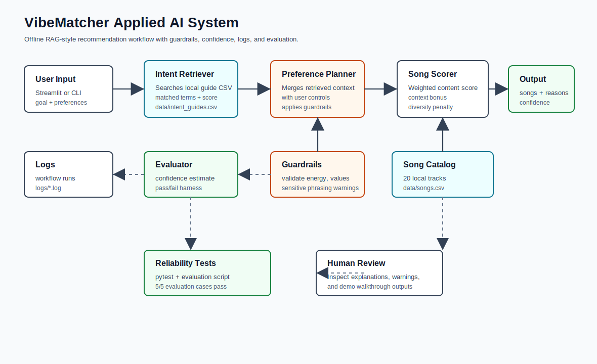
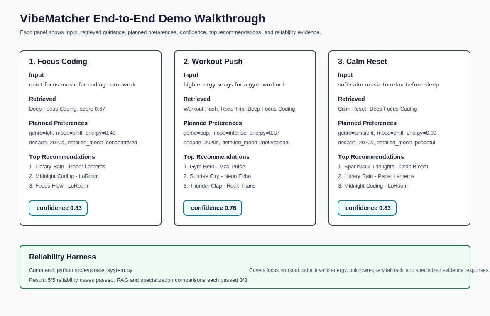

# VibeMatcher Applied AI System

VibeMatcher is an offline applied AI music recommender that turns a plain-language listening goal into explainable song recommendations. It retrieves relevant listening-intent guidance, plans guarded preference settings, reranks a local song catalog, estimates confidence, and logs each run.

No AI API key is required. The system uses a lightweight local retrieval workflow over `data/intent_guides.csv` instead of downloading or calling a large model. This keeps the project reproducible on a normal laptop while still demonstrating retrieval-augmented decision-making.

## Original Project

This final project extends my Module 3 project, **Music Recommender Simulation**. The original version was a rule-based content recommender that scored songs using genre, mood, energy, acousticness, popularity, decade, detailed mood, and a diversity penalty. It worked as a small simulation, but users had to manually choose structured preferences and there was no retrieval layer, confidence score, guardrail reporting, or evaluation harness.

## What The System Does

VibeMatcher 2.0 accepts either structured preferences or a natural-language goal such as "quiet focus music for coding homework." The system retrieves a matching listening guide, uses that retrieved context to plan final preferences, scores the local song catalog, applies context-aware reranking and artist diversity penalties, and returns recommendations with explanations.

Core AI features:

- Retrieval-Augmented Generation style workflow using a custom local knowledge base.
- Observable agent-like workflow trace: parse goal, retrieve context, plan preferences, score songs, estimate confidence.
- Guardrails for invalid inputs, unsupported catalog values, sensitive phrasing, and low confidence.
- Reliability harness with pass/fail checks and average confidence reporting.

## Architecture Overview



Data flow:

1. User enters a listening goal in Streamlit or the CLI.
2. The intent retriever searches `data/intent_guides.csv`.
3. The preference planner combines retrieved guidance with optional user controls.
4. Guardrails validate energy, catalog values, booleans, and sensitive phrasing.
5. The scorer ranks songs from `data/songs.csv` with context-fit bonuses and diversity penalties.
6. The evaluator estimates confidence and logs the run.
7. The app returns recommendations, explanations, warnings, and workflow steps.

## Setup Instructions

Use Python 3.10 or newer. This workspace has been verified with Python 3.13.7.

```bash
python3 -m venv .venv
source .venv/bin/activate
python -m pip install -r requirements.txt
```

Run the command-line demo:

```bash
python src/main.py
```

Run the Streamlit app:

```bash
streamlit run src/streamlit_app.py
```

Run tests and reliability evaluation:

```bash
pytest
python src/evaluate_system.py
```

If `python` or `pytest` is not on your shell PATH, use the virtual environment paths directly:

```bash
.venv/bin/python -m pytest -q
.venv/bin/python src/evaluate_system.py
```

## Sample Interactions

### 1. Focus Coding

Input:

```text
I need quiet focus music for coding homework in the rain.
```

Workflow result:

```text
Retrieved 1 listening guide: Deep Focus Coding
Planned preferences: genre=lofi, mood=chill, energy=0.48, decade=2020s
Confidence: 0.83
```

Top outputs:

| Song | Artist | Why |
| --- | --- | --- |
| Library Rain | Paper Lanterns | genre match, mood match, acoustic preference, decade match, retrieved context fit |
| Midnight Coding | LoRoom | genre match, mood match, acoustic preference, retrieved context fit |
| Focus Flow | LoRoom | genre match, acoustic preference, detailed mood match, diversity penalty |

### 2. Workout Push

Input:

```text
Give me high energy songs for a gym workout.
```

Workflow result:

```text
Retrieved 3 listening guides: Workout Push, Road Trip, Deep Focus Coding
Planned preferences: genre=pop, mood=intense, energy=0.87, decade=2020s
Confidence: 0.76
```

Top outputs:

| Song | Artist | Why |
| --- | --- | --- |
| Gym Hero | Max Pulse | genre match, mood match, energy similarity, motivational mood match |
| Sunrise City | Neon Echo | genre match, popularity preference, decade match |
| Thunder Clap | Rock Titans | mood match, high energy similarity, workout context fit |

### 3. Calm Reset

Input:

```text
I want soft calm music to relax before sleep.
```

Workflow result:

```text
Retrieved 2 listening guides: Calm Reset, Deep Focus Coding
Planned preferences: genre=ambient, mood=chill, energy=0.33, decade=2020s
Confidence: 0.83
```

Top outputs:

| Song | Artist | Why |
| --- | --- | --- |
| Spacewalk Thoughts | Orbit Bloom | genre match, mood match, acoustic preference, calm context fit |
| Library Rain | Paper Lanterns | mood match, acoustic preference, decade match |
| Midnight Coding | LoRoom | mood match, acoustic preference, calm context fit |

## Demo Walkthrough



Loom video link: add the recorded Loom URL here before final submission.

The README includes a local visual walkthrough because recording and publishing Loom requires browser/account access outside this repository.

## Design Decisions

- **Offline retrieval instead of an API model:** The project does not need an API key, avoids network failures, and runs quickly in class or portfolio review settings.
- **Custom knowledge base:** `data/intent_guides.csv` is small but inspectable. Each guide includes keywords, target genres, moods, energy, rationale, and a guardrail.
- **Context-aware scoring:** Retrieved context changes the final preferences and adds a ranking bonus, so retrieval affects the output rather than appearing as side information.
- **Transparent explanations:** Every recommendation includes the score reasons used to rank it.
- **Guardrails over hidden behavior:** Invalid energy values are clamped, unsupported categories are ignored, sensitive phrasing produces a warning, and low-confidence runs are flagged.

Trade-off: the system is more reliable and explainable than a black-box model, but it cannot understand language as broadly as a real LLM or embedding model. The custom retrieval set must be expanded for broader coverage.

## Reliability And Testing Summary

Automated checks:

```text
pytest: 5 passed
evaluation harness: 5/5 passed
average confidence: 0.76
```

Evaluation cases covered:

- Focus query should retrieve calm study music.
- Workout query should favor energetic songs.
- Calm query should favor acoustic low-energy songs.
- Invalid energy should be clamped and warned.
- Unknown query should still return safe fallback recommendations.

What worked: retrieval improved outputs when a user gave mismatched structured preferences, such as selecting pop/happy but typing a coding-focus goal. What did not work perfectly: unknown or very unusual goals fall back to structured preferences because the local guide set is intentionally small.

## Reflection

This project taught me that a useful AI system is more than a ranking formula. Retrieval, validation, logging, confidence, and evaluation make the system easier to trust because users can see how the answer was produced and when the system is uncertain.

The largest limitation is coverage. A 20-song catalog and six listening guides can demonstrate the architecture, but they cannot represent all cultures, genres, languages, or listening contexts. The system could be misused if someone treated it as emotional or health advice, so it includes safety warnings and frames recommendations as music suggestions only.

During AI collaboration, a helpful suggestion was adding an evaluation harness instead of relying only on visual inspection of recommendations. A flawed suggestion was assuming a larger model or API was necessary; for this project, a smaller offline retrieval system was more reproducible and easier to explain.

## Portfolio Artifact

GitHub repository: <https://github.com/shibirahul/ai110-module3show-musicrecommendersimulation-starter>

Short portfolio reflection: This project shows that I can turn a simple prototype into a more complete applied AI system with retrieval, modular design, testing, guardrails, documentation, and user-facing explanations.

## File Guide

- `src/recommender.py` - core retrieval, planning, scoring, guardrails, confidence, and logging.
- `src/streamlit_app.py` - interactive app.
- `src/main.py` - CLI demo with three end-to-end runs.
- `src/evaluate_system.py` - reliability harness.
- `tests/test_recommender.py` - unit and workflow tests.
- `data/songs.csv` - local song catalog.
- `data/intent_guides.csv` - custom retrieval knowledge base.
- `assets/system_architecture.svg` - architecture diagram.
- `assets/demo_walkthrough.svg` - visual demo transcript.
- `model_card.md` - responsible AI reflection and model documentation.
- `presentation_outline.md` - 5-7 minute presentation outline.
